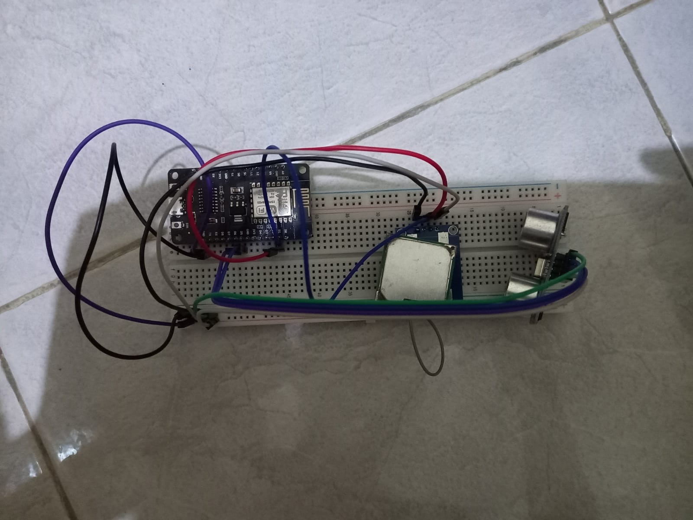

# **Sijaki IoT**

---

## **📃Table of Contents**  
1. [Introduction](#introduction)  
2. [Features](#features)  
3. [System Architecture](#system-architecture)  
4. [Hardware Requirements](#hardware-requirements)  
5. [Installation](#installation)  
6. [Usage](#usage)  
7. [Closing Remarks](#closing-remarks)  

---

## **😁Introduction**  
The Sijaki IoT device collects data from sensors that monitor the fullness level of trash bins. This data is transmitted to an MQTT server, where it becomes accessible to the central application system. The application processes this data to provide users with real-time information about the trash bins' fullness levels and their locations. This system aims to optimize waste management and enhance user convenience.

---

## **🚀Features**  
- Continuously gathers data from sensors to monitor trash bin fullness levels.  
- Transmits data using MQTT protocol with username and password authentication for secure connectivity.

---

## **🎯System Architecture**  


---

## **⚒️Hardware Requirements**  
- ESP8266 : Microcontroller.  
- HC-SR04 : Ultrasonic distance sensor.  
- Neo-6M GPS Module : GPS sensor

---

## **🪄Installation**  
### MQTT
1. Ensure the following tools are installed on your server (i'm using Ubuntu):
    > **Note:** I'm using Ubuntu
    - `docker-compose`  
    - `git`  
    - `ufw` 
2. Clone this repository to your server using Git:  
      ```bash
      git clone https://github.com/dzakimaulana/SiJaki-IoT.git
      ```
3. Navigate to the mosquitto folder:
    > **Note:** You can delete sijaki folder, because we only use mosquitto folder in server.
      ``` bash
      cd mosquitto
      ```
4. Use Docker Compose to run the broker services:
      ``` bash
      sudo docker-compose up -d
      ```
5. Configure UFW to allow traffic for MQTT and WebSocket:
      ``` bash
      sudo ufw allow 1883 comment "Allow MQTT traffic"
      sudo ufw allow 9001 comment "Allow MQTT over WebSockets"
      ```
### Hardware
1. Place Components According to the System Architecture  
    Ensure that all components are placed as outlined in the system architecture diagram to ensure proper connectivity and functionality.
2. Install Arduino IDE
    If you don't have Arduino IDE installed, download and install it from the [official Arduino website](https://www.arduino.cc/en/software).
3. Install the ESP8266 board in Arduino IDE:
    - Open Arduino IDE.
    - Go to **File** > **Preferences**.
    - In the **Additional Boards Manager URLs** field, add the following URL:
      ```
      http://arduino.esp8266.com/stable/package_esp8266com_index.json
      ```
    - Go to **Tools** > **Board** > **Boards Manager**.
    - Search for `ESP8266` and click **Install** on the `esp8266 by ESP8266 Community` entry.
4. Install the necessary libraries for the project:
    > **Go to:** **Sketch** > **Include Library** > **Manage Libraries**
    - **PubSubClient** (for MQTT)
    - **TinyGPS++** (for GPS)
    - **ArduinoJson** (for JSON parsing)
    - **ESP8266WiFi** (for Wi-Fi connectivity)
---

## **✈️Usage**
1. Clone this repository to your server using Git:  
    > **Note:** You can delete mosquitto folder, because we only use sijaki folder in computer.
      ```bash
      git clone https://github.com/dzakimaulana/SiJaki-IoT.git
      ``` 
2. Open the Sijaki folder in Arduino IDE.
3. Connect the microcontroller with micro USB cable.
4. Open serial monitor and set the baud rate to **9600** 
---

## **🫡Closing Remarks**
Thank you for taking the time to review this project. While this project may not be fully developed to its maximum potential, I have focused on delivering a working solution that addresses urban waste management. 

Given the breadth of other projects and commitments at the university, I wasn't able to dedicate as much time as I would have liked, but I believe the concept holds significant potential for further development.

I welcome any feedback or suggestions for improvement and would be grateful for your insights.

Thank you again for your time and consideration.